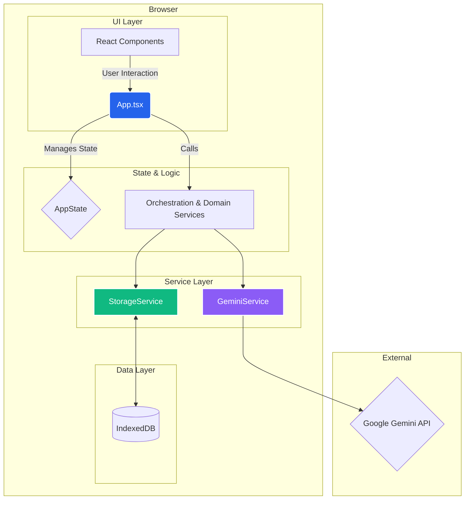

# Anwendungsarchitektur: MRV-Assistent

## 1. Gesamtüberblick

Der MRV-Assistent ist eine **rein clientseitige Single-Page-Anwendung (SPA)**. Die Architektur ist darauf ausgelegt, maximale Datensicherheit und Offline-Fähigkeit zu gewährleisten, indem keine Fall-Daten an einen externen Server gesendet werden (mit Ausnahme der anonymisierten Anfragen an die Gemini-API).

Die Kernprinzipien der Architektur sind:

-   **Zustand im Client:** Alle Anwendungs- und Falldaten werden in der **IndexedDB** des Browsers gespeichert.
-   **Service-Orientierung:** Die Geschäftslogik ist in spezialisierte "Services" gekapselt, was die Wartbarkeit und Testbarkeit verbessert.
-   **Zentralisierte KI-Kommunikation:** Alle Aufrufe an die KI werden über einen einzigen, robusten Service (`GeminiService`) geleitet.
-   **Komponentenbasierte UI:** Die Benutzeroberfläche wird mit React 18 und funktionalen Komponenten aufgebaut.

## 2. Frontend-Architektur

### 2.1. View Layer (React)

-   Die UI besteht aus React 18-Komponenten, die über ein CDN via `importmap` geladen werden.
-   Die Hauptkomponente `App.tsx` fungiert als "Smart Component" oder Controller, der den gesamten Anwendungszustand (`AppState`) hält und die Logik über Props an die "Dumb Components" (in `components/`) weitergibt.
-   Die Navigation zwischen den Ansichten (Tabs) wird durch die Aktualisierung des `activeTab`-Zustands in `App.tsx` gesteuert.

### 2.2. State Management

-   Der Anwendungszustand wird in einem einzigen, großen Objekt (`AppState`) innerhalb der `App.tsx`-Komponente mit dem `useState`-Hook verwaltet.
-   **Vorteil:** Einfachheit und klare Nachvollziehbarkeit des Datenflusses für eine Anwendung dieser Größe.
-   **Potenzieller Nachteil:** Bei weiterem Wachstum könnten Performance-Probleme durch häufige Re-Renders der gesamten Anwendung entstehen. Ein möglicher Refactoring-Schritt wäre der Einsatz von `useReducer` oder einer schlanken State-Management-Bibliothek wie Zustand.

### 2.3. Styling

-   Das Styling erfolgt ausschließlich über **Tailwind CSS**, das als CDN-Skript in die `index.html` eingebunden ist. Dies ermöglicht schnelles Prototyping ohne einen Build-Schritt.

## 3. Daten- & Service-Schicht

### 3.1. Persistence Layer (`storageService.ts`)

-   **Technologie:** IndexedDB wird als clientseitige NoSQL-Datenbank verwendet.
-   **Funktion:** Der `storageService` bietet eine asynchrone API (Promise-basiert) für alle CRUD-Operationen (Create, Read, Update, Delete) auf den Daten. Er abstrahiert die Komplexität von IndexedDB und stellt typsichere Funktionen für jeden Datentyp (Store) bereit (z.B. `getAllDocuments`, `addEntity`).
-   **Features:** Bietet auch Kernfunktionen wie den vollständigen **Import/Export** des Anwendungszustands als JSON.

### 3.2. AI Integration Layer (`geminiService.ts`)

-   Dies ist eine der kritischsten Komponenten der Anwendung.
-   **Single Gateway:** Alle KI-Anfragen müssen diesen Service durchlaufen.
-   **Rate Limiting & Throttling:** Implementiert eine robuste Warteschlange, um die API-Ratenbegrenzungen (z.B. 15 Anfragen pro Minute) nicht zu überschreiten. Jede Anfrage wird mit einer Verzögerung bearbeitet.
-   **Retry-Mechanismus:** Behandelt automatisch `429 (Too Many Requests)`-Fehler mit einer exponentiellen Backoff-Strategie, was die Anwendung sehr widerstandsfähig macht.
-   **Schema-Validierung:** Bietet eine `callAIWithSchema`-Methode, die strukturierte JSON-Antworten von der Gemini-API anfordert und parst.

### 3.3. Business Logic Layer (Domain Services)

-   Spezifische Logiken sind in eigene Services ausgelagert (z.B. `caseAnalyzerService`, `documentAnalystService`, `contradictionDetectorService`).
-   **Aufgabe:** Diese Services sind dafür verantwortlich, die korrekten Prompts für die KI zu erstellen, den `geminiService` aufzurufen und die Ergebnisse in das für die Anwendung benötigte Format zu transformieren.

## 4. Kern-Workflows

### 4.1. Kontext-Erstellung (`contextUtils.ts`)

-   Die Funktion `buildCaseContext` ist das Herzstück der "Kontext-Intelligenz". Sie aggregiert dynamisch relevante Daten aus dem `AppState` (Fallbeschreibung, Dokumente, Entitäten etc.) in einen zusammenhängenden Textblock. Dieser Kontext wird bei fast jeder KI-Anfrage mitgesendet, um der KI ein umfassendes Verständnis des Falls zu geben.

### 4.2. Workflow-Orchestrierung (`orchestrationService.ts`)

-   Für komplexe Aufgaben wie die Analyse eines neuen Dokuments wird ein mehrstufiger Prozess durchlaufen.
-   Der `orchestrationService` koordiniert die Aufrufe an verschiedene Domain-Services in einer logischen Reihenfolge.
-   **Beispiel (Neues Dokument):**
    1.  `DocumentAnalystService`: Extrahiert Zusammenfassung, Entitäten, Tags etc.
    2.  `ContradictionDetectorService`: Vergleicht die neue Zusammenfassung mit allen bestehenden Dokumenten.
    3.  `InsightService`: Generiert basierend auf den neuen Informationen strategische Einblicke.
    4.  Das Ergebnis wird gebündelt an `App.tsx` zurückgegeben, um den Zustand in einer einzigen Transaktion zu aktualisieren.

## 5. Architektur-Diagramm (Mermaid)

