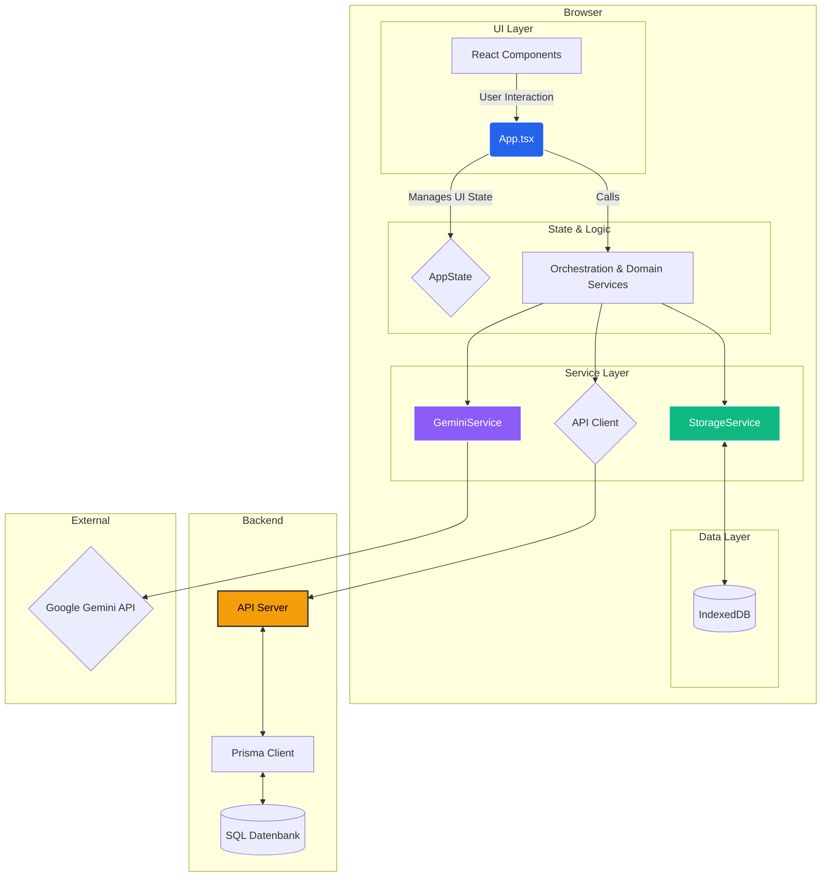

# Anwendungsarchitektur: MRV-Assistent

## 1. Gesamtüberblick

Der MRV-Assistent entwickelt sich von einer rein clientseitigen Anwendung zu einer **hybriden Architektur**. Das Ziel ist es, die Vorteile der Offline-Fähigkeit und Datensicherheit des Clients mit den Möglichkeiten einer zentralen Datenbank für Kollaboration und erweiterte Datenverarbeitung zu verbinden.

Die Kernprinzipien der Architektur sind:

-   **Hybride Datenhaltung:** Sensible, in Bearbeitung befindliche Daten können weiterhin lokal in **IndexedDB** gehalten werden. Das Backend mit einer **SQL-Datenbank** (via Prisma) dient als "Source of Truth" für die Kollaboration.
-   **Service-Orientierung:** Die Geschäftslogik ist in spezialisierte "Services" gekapselt.
-   **Zentralisierte KI-Kommunikation:** Alle KI-Aufrufe werden über den robusten `GeminiService` geleitet.
-   **Komponentenbasierte UI:** Die Benutzeroberfläche wird mit React 18 aufgebaut.

## 2. Backend & Datenbank-Schicht (NEU)

### 2.1. ORM (Prisma)

-   **Technologie:** Prisma wird als Object-Relational Mapper (ORM) verwendet, um typsicher mit der Datenbank zu interagieren.
-   **Schema:** Die gesamte Datenstruktur ist in `prisma/schema.prisma` definiert. Dieses Schema ist die "Single Source of Truth" für die Datenbankstruktur und leitet die Typen für den Prisma Client ab.
-   **Migration:** Prisma Migrate wird verwendet, um Schemaänderungen versioniert und sicher auf die Datenbank anzuwenden.

### 2.2. Datenbank

-   **Entwicklung:** Für die lokale Entwicklung wird **SQLite** verwendet, um den Einrichtungsaufwand minimal zu halten. Die Datenbankdatei (`dev.db`) befindet sich im `prisma`-Verzeichnis.
-   **Produktion:** Für den produktiven Einsatz wird **PostgreSQL** empfohlen, da es eine bessere Skalierbarkeit und Robustheit bietet. Die Umstellung erfolgt durch eine einfache Änderung im `datasource`-Block der `schema.prisma`.

## 3. Frontend-Architektur

### 3.1. View Layer (React)

-   Die UI besteht aus React 18-Komponenten, die über `importmap` geladen werden.
-   Die Hauptkomponente `App.tsx` hält den clientseitigen Zustand (`AppState`) und agiert als Controller.

### 3.2. State Management

-   Der clientseitige Zustand wird in `App.tsx` mit dem `useState`-Hook verwaltet. Dies ist für die UI- und Sitzungsdaten ausreichend.
-   **Zukünftige Integration:** Die Services werden erweitert, um Daten nicht nur aus dem `storageService` (IndexedDB), sondern auch von einer (noch zu erstellenden) API-Schicht abzurufen, die mit dem Prisma-Client interagiert.

## 4. Daten- & Service-Schicht

### 4.1. Persistence Layer (`storageService.ts`)

-   **Technologie:** IndexedDB.
-   **Funktion:** Dient weiterhin als **Offline-Cache** und Speicher für temporäre oder private Daten. Bietet eine asynchrone API für alle CRUD-Operationen auf den lokalen Daten.

### 4.2. AI Integration Layer (`geminiService.ts`)

-   Unverändert eine der kritischsten Komponenten.
-   **Funktionen:** Single Gateway zur Gemini-API, Rate Limiting, Retry-Mechanismus, Schema-Validierung.

## 5. Architektur-Diagramm (Mermaid)

